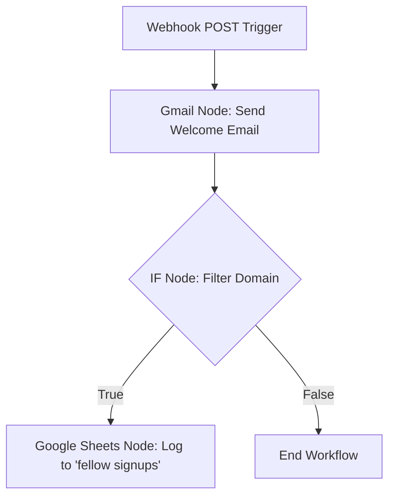
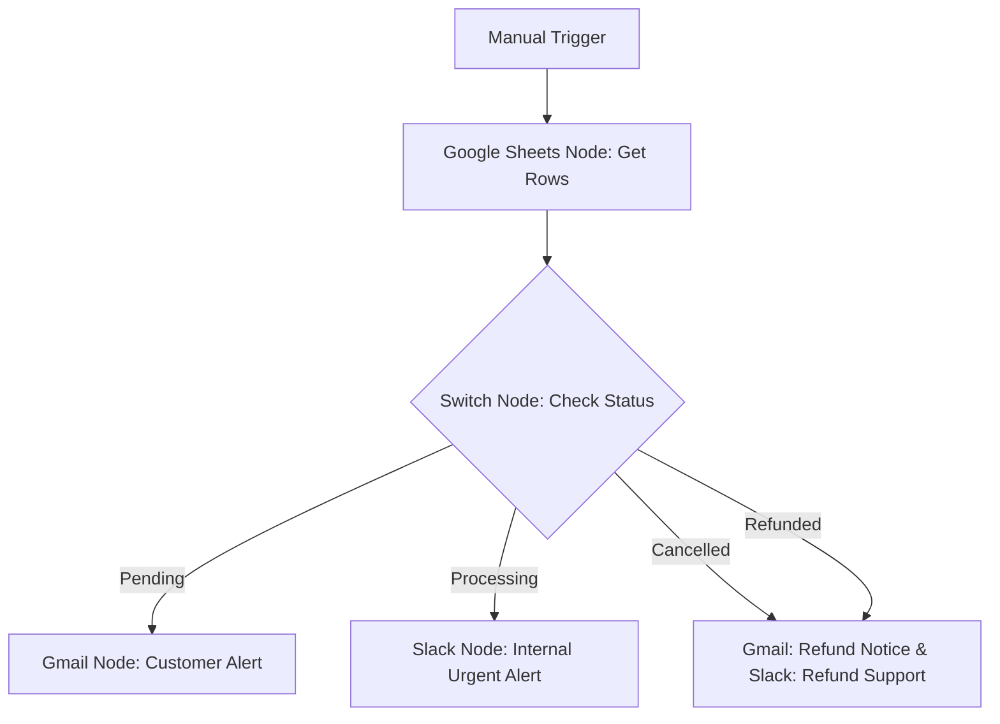
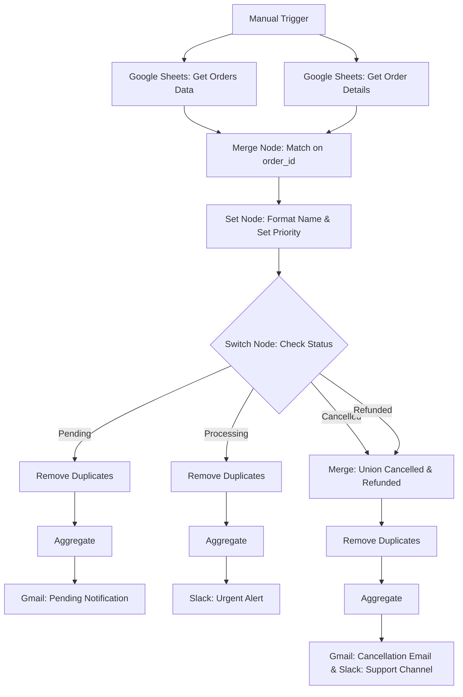
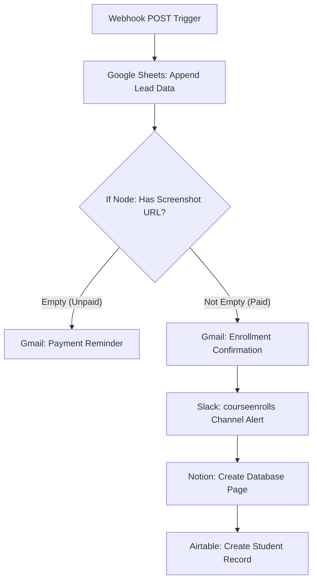
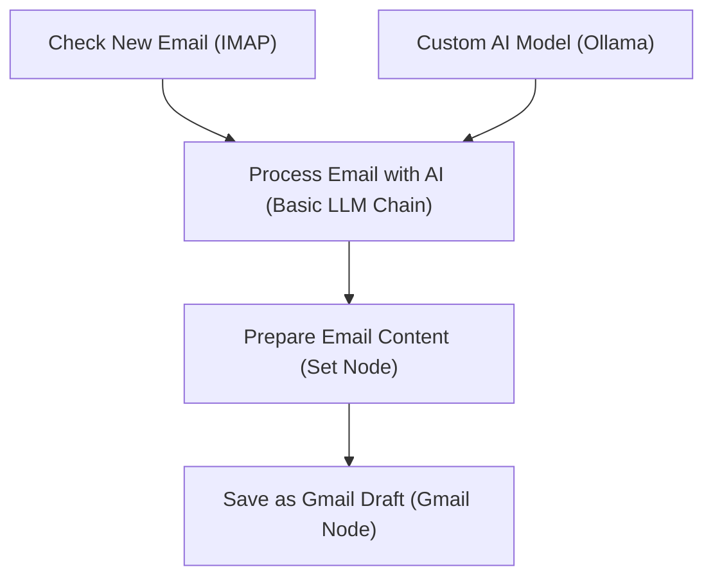

# 🚀 My n8n Automation Journey

Welcome to my **n8n learning repository**! This space is dedicated to documenting my journey, experiments, and workflows as I master **n8n**—the powerful node-based workflow automation tool.

Here, I store my exported workflow `.json` files, notes on implementation, and lessons learned along the way.

---

## 📂 Project Directory

| Workflow File | Description | Key Integrations / Nodes |
| :--- | :--- | :--- |
| [Welcome Email.json](https://github.com/fairywsr/n8n/blob/main/Welcome%20Email.json) | Welcomes new form submissions via email and logs their details to Google Sheets. | Webhook, Gmail, IF Node, Google Sheets |
| [orders status Alerts.json](https://github.com/fairywsr/n8n/blob/main/orders%20status%20Alerts.json) | Monitors order status changes in a Google Sheet and sends tailored alerts via Gmail and Slack. | Google Sheets, Switch Node, Gmail, Slack |
| [EmailTrigger.json](https://github.com/fairywsr/n8n/blob/main/EmailTrigger.json) | Processes incoming emails with attachments, uploads attachments to a temp file server, and automatically logs the uploads as Notion tasks with embedded images. | Gmail Trigger, Filter Node, Split Out, Loop Over Items, HTTP Request, Notion Node, Wait Node |
| [Merge-node.json](https://github.com/fairywsr/n8n/blob/main/Merge-node.json) | Merges customer order data and order status sheets, calculates dynamic priority rules, removes duplicates, and alerts via Slack and Gmail based on status branches. | Google Sheets, Merge Node, Set Node (Edit Fields), Switch Node, Remove Duplicates, Aggregate, Gmail, Slack |
| [courses_Management.json](https://github.com/fairywsr/n8n/blob/main/courses_Management.json) | Captures student course registration webhooks, registers data to Google Sheets, routes confirmation or payment reminders based on payment screenshots, alerts on Slack, and syncs data to Notion and Airtable. | Webhook Trigger, Google Sheets, If Node, Gmail, Slack, Notion, Airtable |
| [EmailDrafts.json](https://github.com/fairywsr/n8n/blob/main/EmailDrafts.json) | Triggers from incoming mail via IMAP, drafts an AI response using a local Ollama model, and saves it as a Gmail draft. | IMAP Email Read, Basic LLM Chain, Ollama Model, Set Node, Gmail |

---

## 🛠️ Featured Workflow 1: Welcome Email

This is my first n8n automation! It automates the onboarding process when someone fills out a form or triggers a webhook.

### 🔄 How It Works (Workflow Flow)



### 🧩 Node Breakdown

1. **Webhook Trigger (POST)**
   - **Purpose:** Acts as the entry point, listening for incoming data from a form or external system.
   - **Expected Payload:**
     ```json
     {
       "Name": "John Doe",
       "Email": "john@example.com",
       "Gender": "Male",
       "Any message": "Looking forward to learning!"
     }
     ```

2. **Send a Message (Gmail Node)**
   - **Purpose:** Sends a personalized welcome email.
   - **Email Subject:** `Welcome to n8n automation learning`
   - **Email Body:**
     > Hi **[Name]**, Welcome to My first n8n automation. I am glad you filled out the form and received this email. Thank you for your support. Stay blessed.  
     > _Regards, Faria_

3. **If Condition (Logical Filter)**
   - **Purpose:** Routes data based on the email domain.
   - **Conditions Checked:**
     - Is email domain not ending with `gmail.com`?
     - **OR**
     - Is email domain not ending with `hotmail.com`?

4. **Append Row in Sheet (Google Sheets Node)**
   - **Purpose:** Logs signup data into a Google Spreadsheet.
   - **Spreadsheet Name:** `fellow signups`
   - **Mapped Fields:** `Name`, `Email`, `Gender`, `Message`.

---

## 🛠️ Featured Workflow 2: Order Status Alerts

This workflow monitors order status updates from a Google Sheets document and automatically routes notification alerts to customers (via Gmail) and internal operations channels (via Slack).

### 🔄 How It Works (Workflow Flow)



### 🧩 Node Breakdown

1. **Manual Trigger**
   - **Purpose:** Acts as the manual testing point to initiate the sheet data pull.

2. **Get row(s) in sheet (Google Sheets Node)**
   - **Purpose:** Fetches the mock order dataset containing fields like `order_id`, `customer_email`, and `order_status`.
   - **Source Spreadsheet:** `Mock_Orders_Data`
   - **Sheet Tab:** `Mock_Order_Data`

3. **Switch Node (Multi-path Routing)**
   - **Purpose:** Segregates incoming order data dynamically based on the value of the `order_status` property.
   - **Routed Branches:**
     - **Pending:** Sends a standard update email to the customer.
     - **Processing:** Sends a Slack message flagging the order as high priority.
     - **Cancelled:** Sends a cancellation email to the customer and triggers a refund alert on Slack.
     - **Refunded:** Triggers the same cancellation/refund communications (Gmail and Slack).

4. **Gmail Notifications**
   - **Purpose:** Dispatches localized updates to `customer_email` with state-specific messages (e.g., pending notification vs. cancel/refund notification).

5. **Slack Notifications**
   - **Purpose:** Alerts support staff in channels like `#all-testing-n8n` and `#cancel-and-refunded-orders` to manage urgent processing or refund processing.

---

## 🛠️ Featured Workflow 3: Gmail Attachment Notion Task Tracker

This workflow automates the extraction and storage of email attachments. When an email with attachments is received, it uploads them to a temporary file sharing service and logs them as task entries in a Notion database with embedded attachment previews.

### 🔄 How It Works (Workflow Flow)

```mermaid
graph TD
    A[Gmail Trigger: Poll Every Minute] --> B{Filter: Has Attachments?}
    B -- "Yes" --> C[Split Out: Extract Binary Files]
    C --> D[Loop Over Items: Process Individually]
    D -- "Item Data" --> E[HTTP Request: Upload to tmpfiles.org]
    E --> F[Notion: Create task tracker page with attachment link]
    F --> G[Wait: Pause 2 Seconds]
    G --> D
    D -- "Done" --> H[End Loop (No-Op Node)]
```

### 🧩 Node Breakdown

1. **Gmail Trigger**
   - **Purpose:** Polls Gmail inbox every minute for new emails.
   - **Configuration:** Set to download attachments, prefixing them with `attachment_` for downstream processing.
2. **Filter (Attachment Check)**
   - **Purpose:** Ensures the workflow only executes if the email contains attachments.
   - **Condition:** Evaluates whether `{{ $("Gmail Trigger").item.binary }}` is defined.
3. **Split Out**
   - **Purpose:** Disassembles the binary files array into individual objects so they can be processed sequentially.
4. **Loop Over Items (Split in Batches)**
   - **Purpose:** Iterates through each file attachment in sequence.
5. **HTTP Request (Upload Attachment)**
   - **Purpose:** Performs a `POST` request to `https://tmpfiles.org/api/v1/upload` as `multipart/form-data` containing the file attachment. Returns a public, temporary URL for the file.
6. **Create a database page (Notion Node)**
   - **Purpose:** Logs a new page in a database named **Tasks Tracker**.
   - **Configuration:** Sets status to `Not started`, sets title to `task: [Email Subject]`, and embeds the uploaded image URL as a block using `{{ $json.data.url }}`.
7. **Wait**
   - **Purpose:** Pauses execution for 2 seconds before returning to the loop to rate-limit external API calls.
8. **here loop end no nothing (NoOp Node)**
   - **Purpose:** Acts as the terminal node when the batch loop completes.

---

## 🛠️ Featured Workflow 4: Order Status & Notification Dispatcher

This workflow combines multiple data sources using the `Merge` node, evaluates delivery priorities, filters out duplicates, and batches notifications for Slack and Gmail alerts based on order status.

### 🔄 How It Works (Workflow Flow)



### 🧩 Node Breakdown

1. **When clicking ‘Execute workflow’ (Manual Trigger)**
   - **Purpose:** Starts the workflow execution manually for testing purposes.
2. **get-orders-data & get orders details (Google Sheets Nodes)**
   - **Purpose:** Retrieves two sets of data: spreadsheet order customer info and order status logs.
3. **Merge (Combine Data)**
   - **Purpose:** Joins the two sheet datasets on the common field `order_id`.
4. **Edit Fields (Set Node)**
   - **Purpose:** Constructs custom fields and removes unnecessary columns:
     - `full_Name`: Combines `first_name` and `last_name`.
     - `order_prority`: Computes priority based on date: if order status is `processing` and dates exceed 7 days, mark as `high`, otherwise `standard`.
     - **Cleanup:** Excludes original columns `first_name` and `last_name`.
5. **Switch (Multi-path Routing)**
   - **Purpose:** Directs records to specific flows depending on status: `Pending`, `Processing` (if priority is high), `Cancelled`, or `Refunded`.
6. **Remove Duplicates & Aggregate Nodes**
   - **Purpose:** Filters records based on `order_id` and aggregates multiple order IDs into a single list format. This ensures only a single summarized notification is sent instead of separate emails for every order.
7. **Merge1 (Union Node)**
   - **Purpose:** Merges the Cancelled and Refunded order streams back together before deduplication and notification dispatch.
8. **Slack & Gmail Notifications**
   - **Purpose:** Dispatches status summaries to customers via Gmail and alerts internal teams via targeted Slack channels (`#all-testing-n8n` and `#cancel-and-refunded-orders`).

---

## 🛠️ Featured Workflow 5: Course Enrollment & Lead Management

This workflow manages student signups. When a signup webhook triggers, it logs details to Google Sheets and evaluates if a registration fee screenshot has been uploaded. Depending on the payment status, it issues reminders or enrollment confirmations across Gmail, Slack, Notion, and Airtable.

### 🔄 How It Works (Workflow Flow)



### 🧩 Node Breakdown

1. **Webhook Trigger (POST)**
   - **Purpose:** Receives webhook payload containing name, email, phone number, and a screenshot URL of payment.
2. **Append Row in Sheet (Google Sheets Node)**
   - **Purpose:** Logs form submissions in `Lead Management workflow n8n` spreadsheet.
3. **If (Payment Verification)**
   - **Purpose:** Determines if a payment screenshot URL was submitted.
4. **Reminder Email (Gmail Node - Unpaid)**
   - **Purpose:** Runs when screenshot URL is empty. Sends a prompt asking the student to pay the Rs 25,000 fee and respond with a screenshot.
5. **Confirmation Email (Gmail Node - Paid)**
   - **Purpose:** Runs when screenshot URL exists. Confirms receipt and successful enrollment.
6. **Send a Message (Slack Node)**
   - **Purpose:** Sends course enrollment details to the team on Slack (`#courseenrolls` channel).
7. **Create a Database Page (Notion Node)**
   - **Purpose:** Registers an entry in Notion database **Tasks Tracker** with the student details.
8. **Create a Record (Airtable Node)**
   - **Purpose:** Logs student data and records the course name ("Reiki") in Airtable database **Record of students**.

---

## 🛠️ Featured Workflow 6: Smart Email Draft Generator

This workflow automates draft email creation. When a new email arrives via IMAP, the workflow extracts the email text, processes it using a local AI model (Ollama) to draft a response, formats the reply content, and saves it directly in Gmail as a draft.

### 🔄 How It Works (Workflow Flow)



### 🧩 Node Breakdown

1. **Check New Email (IMAP)**
   - **Purpose:** Triggers the workflow when a new email is received in the monitored mailbox via IMAP.
2. **Process Email with AI (Basic LLM Chain)**
   - **Purpose:** Orchestrates the LLM prompt. It takes the plain text of the email (`{{ $json.textPlain }}`) and passes it to the AI model with instructions to draft a reply.
3. **Custom AI Model (Ollama)**
   - **Purpose:** Connects a local Ollama instance (using model `llama3.2-16000:latest`) to generate the draft reply response.
4. **Prepare Email Content (Set Node)**
   - **Purpose:** Standardizes the email draft variables:
     - `from`: Extracts the sender of the original email.
     - `subject`: Appends `Re: ` to the original subject line.
     - `text`: Captures the AI model's text output.
5. **Save as Gmail Draft (Gmail Node)**
   - **Purpose:** Creates a new draft in Gmail using the prepared subject and body.

---

## 💡 Learning Insights & Tips

> [!TIP]
> **Understanding the `IF` Combinator Logic:**
> In the `Welcome Email` workflow, the `IF` node uses an **`OR`** combinator with two negative conditions:
>
> - `Email notEndsWith gmail.com` **OR** `Email notEndsWith hotmail.com`
> - **Behavior:** Because it is set to `OR`, **every single email will pass to the True branch**. For example, a `gmail.com` address does not end with `hotmail.com` (which is true), so the condition passes.
> - **Fix:** To filter out _both_ Gmail and Hotmail addresses, change the combinator from `OR` to **`AND`** in the `IF` node parameters.
>
> [!TIP]
> **Parallel Node Connections in Switch / Routing Nodes:**
> In the `orders status Alerts` workflow, both the `Cancelled` and `Refunded` branches of the Switch node are connected to **two destination nodes simultaneously** (Gmail for customers and Slack for internal operations). n8n executes all connected branches in parallel automatically without needing split or fork nodes, making multi-channel notifications extremely straightforward.
>
> [!TIP]
> **Rate Limiting Loops with Wait Nodes:**
> In the `EmailTrigger` workflow, the `Wait` node is positioned inside the loop. This is an essential pattern for processing items in batches (e.g. uploading images or calling Notion APIs) as it prevents triggering API rate limits or overloading remote endpoints.
>
> [!TIP]
> **Consolidating Messages with Aggregate & Remove Duplicates:**
> Instead of executing an alert action for every single incoming row, the `Merge-node` workflow uses `Remove Duplicates` followed by `Aggregate`. This collects all processed `order_id` values into a list so that a single summarized Gmail or Slack message is dispatched, vastly improving user experience and API efficiency.
>
> [!TIP]
> **Re-joining Multiple Execution Branches (Merge Node as Union):**
> In `Merge-node.json`, the Switch node separates "Cancelled" and "Refunded" orders for distinct initial processing, but then merges them back together using `Merge1` set to combine/union. This allows the same notification block to process both states without replicating downstream nodes.
>
> [!TIP]
> **Running Local AI Models with Ollama:**
> In the `EmailDrafts` workflow, the `Ollama` node connects to a local Ollama service. Ensure that your Ollama server is running locally (defaulting to `http://localhost:11434` or `http://host.docker.internal:11434` in Docker) and that the specified model (`llama3.2-16000:latest` or similar) has been downloaded beforehand via command line (`ollama pull llama3.2-16000:latest`).

---

## 🚀 How to Import and Use These Workflows

Follow these general steps to import and configure any workflow from this repository in your own n8n instance:

### 1. Import to n8n
1. Open the workflow `.json` file you want to use from this repository (for example, [Welcome Email.json](https://github.com/fairywsr/n8n/blob/main/Welcome%20Email.json)).
2. Click on the **Raw** button on GitHub to view the raw JSON text, and copy the entire contents.
3. Open your n8n workspace, create a new workflow, and click on the canvas.
4. Press `Ctrl + V` (or `Cmd + V` on Mac) to paste the workflow nodes directly onto the canvas, or use the **Import from File** option in the top-right menu.

### 2. Configure Credentials
Imported workflows will show warning badges on nodes requiring external accounts:
1. Double-click the node showing the warning (e.g. Gmail, Google Sheets, Slack, OpenAI, etc.).
2. Under the credentials section, select your existing n8n account connection, or click **Create New Credential** to authenticate and link your account.

### 3. Update Custom Parameters
Before running the workflow, make sure to adjust node settings to match your setup:
* **Spreadsheets & Databases:** Open the nodes and select your own spreadsheets, database names, or lists.
* **Webhook URLs:** If the workflow starts with a Webhook node, n8n will generate a new webhook URL unique to your instance. Use this new URL to configure your external trigger source.
* **Personalized Values:** Adjust any static email addresses, custom messages, or API variables as needed.

---

## 📈 Road Ahead

- [ ] Add error-handling nodes to notify me if an email fails to send.
- [ ] Connect a Discord/Slack webhook to alert me of new sheet additions in real-time.
- [ ] Experiment with AI nodes (like OpenAI/Anthropic) to draft custom responses based on form input.

---

_Happy Automating! 🤖_
