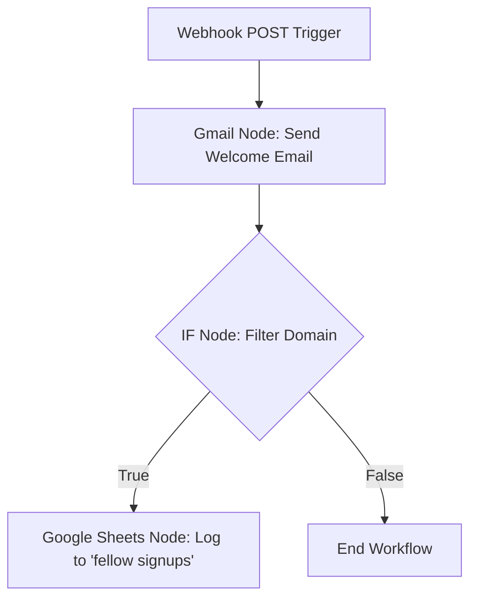

# 🚀 My n8n Automation Journey

Welcome to my **n8n learning repository**! This space is dedicated to documenting my journey, experiments, and workflows as I master **n8n**—the powerful node-based workflow automation tool.

Here, I store my exported workflow `.json` files, notes on implementation, and lessons learned along the way.

---

## 📂 Project Directory

| Workflow File | Description | Key Integrations / Nodes |
| :--- | :--- | :--- |
| [Welcome Email.json](https://github.com/fairywsr/n8n/blob/main/Welcome%20Email.json) | Welcomes new form submissions via email and logs their details to Google Sheets. | Webhook, Gmail, IF Node, Google Sheets |

---

## 🛠️ Featured Workflow: Welcome Email

This is my first n8n automation! It automates the onboarding process when someone fills out a form or triggers a webhook.

### 🔄 How It Works (Workflow Flow)



### 🧩 Node Breakdown

1. **Webhook Trigger (POST)**
   - **Purpose:** Acts as the entry point, listening for incoming data from a form or external system.
   - **Expected Payload:**
     ```json
     {
       "Name": "John Doe",
       "Email": "john@example.com",
       "Gender": "Male",
       "Any message": "Looking forward to learning!"
     }
     ```

2. **Send a Message (Gmail Node)**
   - **Purpose:** Sends a personalized welcome email.
   - **Email Subject:** `Welcome to n8n automation learning`
   - **Email Body:**
     > Hi **[Name]**, Welcome to My first n8n automation. I am glad you filled out the form and received this email. Thank you for your support. Stay blessed.  
     > _Regards, Faria_

3. **If Condition (Logical Filter)**
   - **Purpose:** Routes data based on the email domain.
   - **Conditions Checked:**
     - Is email domain not ending with `gmail.com`?
     - **OR**
     - Is email domain not ending with `hotmail.com`?

4. **Append Row in Sheet (Google Sheets Node)**
   - **Purpose:** Logs signup data into a Google Spreadsheet.
   - **Spreadsheet Name:** `fellow signups`
   - **Mapped Fields:** `Name`, `Email`, `Gender`, `Message`.

---

## 💡 Learning Insights & Tips

> [!TIP]
> **Understanding the `IF` Combinator Logic:**
> In the `Welcome Email` workflow, the `IF` node uses an **`OR`** combinator with two negative conditions:
>
> - `Email notEndsWith gmail.com` **OR** `Email notEndsWith hotmail.com`
> - **Behavior:** Because it is set to `OR`, **every single email will pass to the True branch**. For example, a `gmail.com` address does not end with `hotmail.com` (which is true), so the condition passes.
> - **Fix:** To filter out _both_ Gmail and Hotmail addresses, change the combinator from `OR` to **`AND`** in the `IF` node parameters.

---

## 🚀 How to Import and Use These Workflows

Follow these general steps to import and configure any workflow from this repository in your own n8n instance:

### 1. Import to n8n
1. Open the workflow `.json` file you want to use from this repository (for example, [Welcome Email.json](https://github.com/fairywsr/n8n/blob/main/Welcome%20Email.json)).
2. Click on the **Raw** button on GitHub to view the raw JSON text, and copy the entire contents.
3. Open your n8n workspace, create a new workflow, and click on the canvas.
4. Press `Ctrl + V` (or `Cmd + V` on Mac) to paste the workflow nodes directly onto the canvas, or use the **Import from File** option in the top-right menu.

### 2. Configure Credentials
Imported workflows will show warning badges on nodes requiring external accounts:
1. Double-click the node showing the warning (e.g. Gmail, Google Sheets, Slack, OpenAI, etc.).
2. Under the credentials section, select your existing n8n account connection, or click **Create New Credential** to authenticate and link your account.

### 3. Update Custom Parameters
Before running the workflow, make sure to adjust node settings to match your setup:
* **Spreadsheets & Databases:** Open the nodes and select your own spreadsheets, database names, or lists.
* **Webhook URLs:** If the workflow starts with a Webhook node, n8n will generate a new webhook URL unique to your instance. Use this new URL to configure your external trigger source.
* **Personalized Values:** Adjust any static email addresses, custom messages, or API variables as needed.

---

## 📈 Road Ahead

- [ ] Add error-handling nodes to notify me if an email fails to send.
- [ ] Connect a Discord/Slack webhook to alert me of new sheet additions in real-time.
- [ ] Experiment with AI nodes (like OpenAI/Anthropic) to draft custom responses based on form input.

---

_Happy Automating! 🤖_
